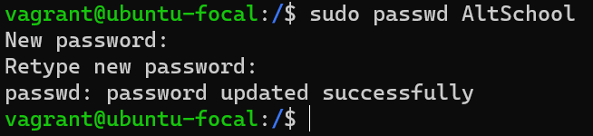
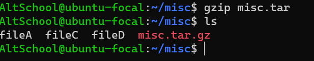

# Assignment 
Your login name: altschool i.e., home directory /home/altschool. 
The home directory contains the following sub-directories: code, tests, personal, misc Unless otherwise specified, you are running commands from the home directory.
a.Change directory to the tests directory using absolute pathname
b.Change directory to the tests directory using relative pathname
c.Use echo command to create a file named fileA with text content ‘Hello A’ in the misc directory
d.Create an empty file named fileB in the misc directory
e.Copy contents of fileA into fileC
f.Move contents of fileB into fileD
g.Create a tar archive called misc.tar for the contents of misc directory h.Compress the tar archive to create a misc.tar.gz file
I. Create a user and force the user to change his/her password upon login
J. Lock a users password
K. Create a user with no login shell
L. Disable password based authentication for ssh
M. Disable root login

# Solution
### A. create a user named Altschool

This image shows how i created AltSchool user into out home directory

###  give our User(AltSchool) a password

This image depicts how i give the user a password, each time i login its going to require this password

### Adding our user(AltSchool to sudoers group)

as this can be optional i choose to add the user to sudoers at this stage

### switch to the user

now have switched to AltSchool User

### creating the directories

this image depicts how i created the directories as instructed

### Changing the directory to tests using absolute pathname 

this image depicts chnaging directory to tests using absolute path

### Changing the directory to tests using relative pathname

this image depicts chnaging directory to tests using absolute path

### using echo command to create a fileA with content in the misc directory

the image above shows how we can use echo command to create a file with content in it

### creating an empty fileB in the misc directory

the image above shows how we can use echo command to create a file with no content in it

### Copying contents from fileA to fileC

the image above shows how we can copy content from fileA into fileC, the ls only list the files withing the misc directory for us to be sure we have the said file copied

### moving content from fileB to fileD

the image above shows how we can move content from fileB into fileD the ls only list the files within the misc directory for us to be sure we have the said file moved

### creating a tar archive

### to compress the tar archieve to create misc.tar.gz file

### Creating a new user and forcing the user to chnage password upon login

.. 

the image above depicts that a user which upon login will prompt it to change passord

### switching to the user with immediate passwdord change upon login

the image above shows how we swtched into the new user and ahncged password upon login

### to lock a user password

this image above depicts how a user assword can be locked 

### Creating a user with no login shell

the image above depicts how to create a user with no login shell, to check for this user is it's actually being craeted we can use... 
awk -F: '$7 ~ /^(\/usr\/sbin\/nologin|\/bin\/false)$/ { print $1 }' /etc/passwd

...Source ChatGPT

### Disable based password authentification for shh

we use our vim to access our sshd_config to change the authentification from yes to no

